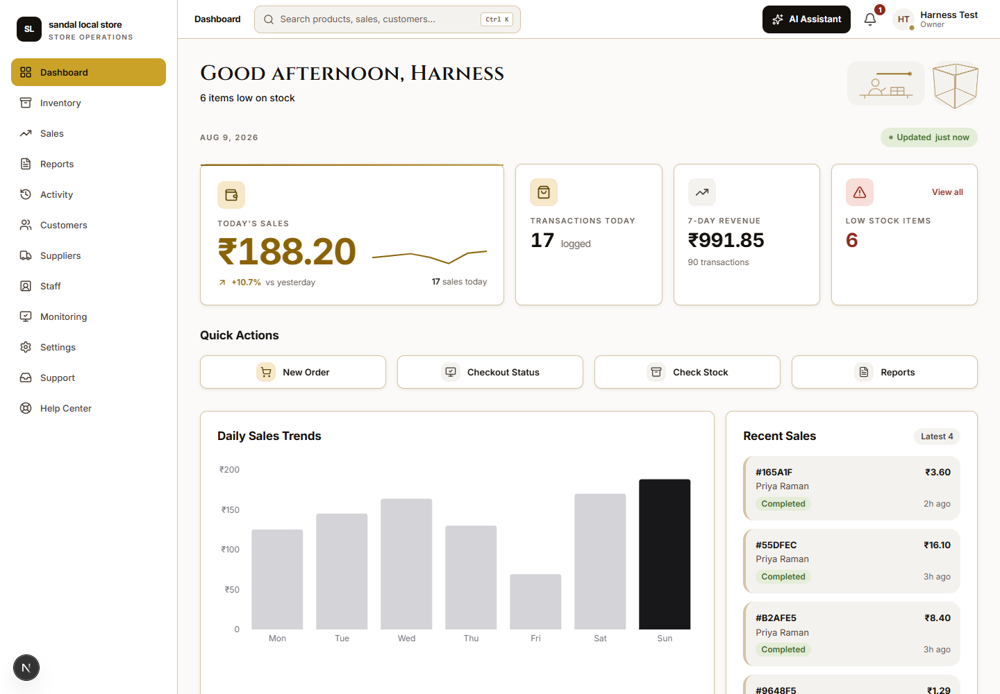
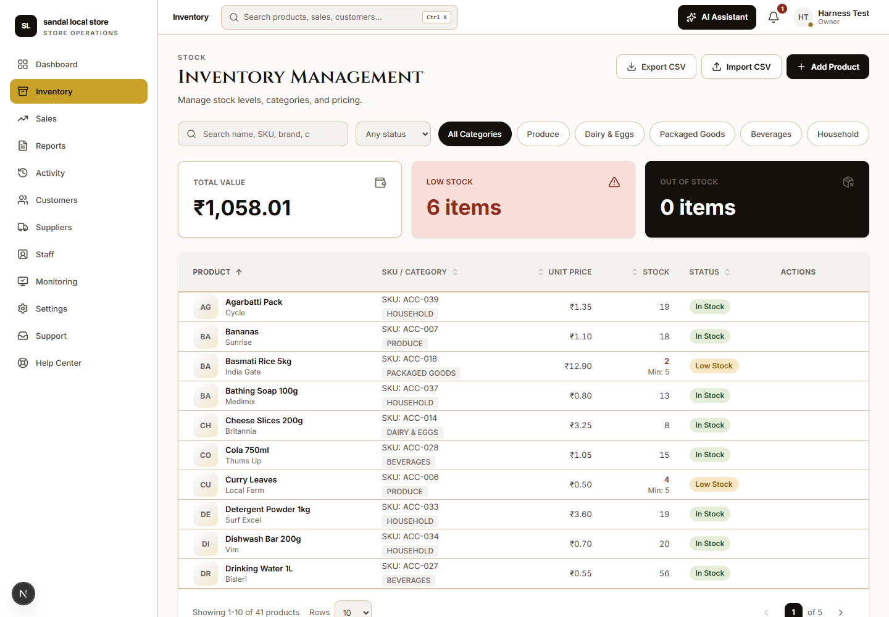
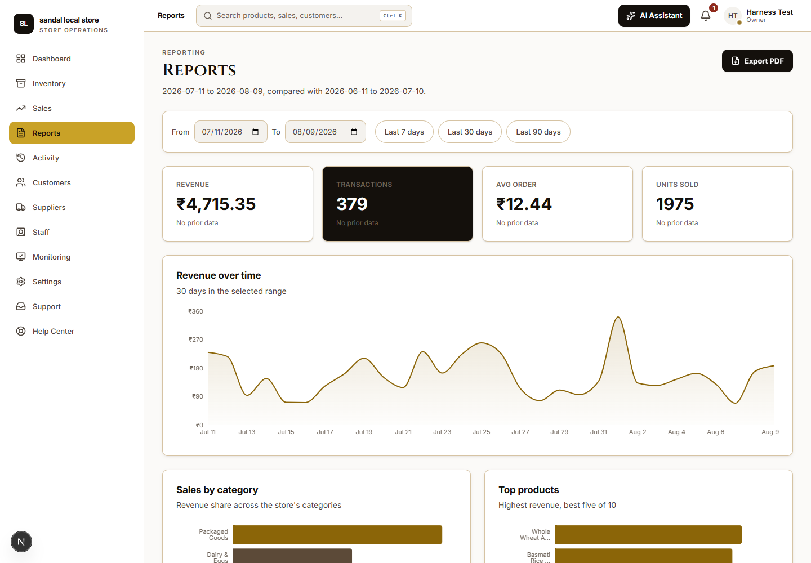

# StockPulse

**Store operations for a neighbourhood grocery — inventory, sales, suppliers,
staff and reporting in one place, built for the person behind the counter.**

Live: **https://stock-pulse-mu.vercel.app**

---

## Try it without signing up

The login screen has an **"Explore the demo store"** button. One click lands
you in a store with 40 products, 5 suppliers, 3 staff and 30 days of sales
already in it, because a reviewer who meets an empty dashboard has seen
nothing.

```
demo@stockpulse.test  /  StockPulseDemo2026!
```

The demo signs in as an **owner**, deliberately — `staff` renders four sidebar
entries and bounces off half the product, and a reviewer would have no way to
know what they were not being shown. The trade-off is stated rather than
hidden: the credentials are public, so anyone can edit that store's data.
Row-level security scopes the account to that one store (measured: it sees 1
store of 4 and zero rows belonging to any other), everything in it is
generated, and re-running the acceptance seed restores it exactly.

---

## Screenshots

| Dashboard | Inventory |
|---|---|
|  |  |



---

## What it does

- **Inventory** — products with brand, SKU, per-store categories, price, stock,
  low-stock thresholds and expiry dates. CSV import and export.
- **Sales** — log a sale against real stock; an atomic Postgres function writes
  the sale, its line items and the stock decrement together, or none of them.
- **Suppliers** — vendors, status, and a purchase-order pipeline from Ordered
  through to At Dock.
- **Reports** — revenue over time, sales by category and top products, with
  period-over-period comparison, CSV per panel and a PDF export.
- **Staff** — invite by email, three roles (owner / manager / staff), a shift
  rota and leave records.
- **Monitoring** — live self-checkout station board.
- **AI assistant** — ask about stock, sales and revenue in plain English;
  Gemini with tool-calling against the real database, gated by role.
- **Everything else** — command palette, notifications, audit trail, support
  requests, help centre, light and dark themes, full keyboard navigation.

Every screen works on a phone. That is not a given — the AI assistant and the
command palette were desktop-only until late in the build, and it took a
measurement rather than a glance to notice.

---

## Stack

| | |
|---|---|
| Framework | Next.js 16 (App Router, Turbopack, Server Actions) |
| Language | TypeScript, React 19 |
| Styling | Tailwind CSS 4, custom design tokens, light + dark |
| Backend | Supabase — Postgres, Auth, Storage, Row-Level Security |
| Charts | Recharts |
| AI | Google Gemini (`@google/genai`) with tool-calling |
| PDF / CSV | jsPDF + autotable, hand-rolled CSV |
| Motion | Framer Motion |
| Hosting | Vercel |

Authorisation is enforced **twice, deliberately**: Postgres RLS is the real
boundary, and `lib/permissions.ts` mirrors it so Server Actions can reject with
a readable message instead of an opaque database error. The two must change
together — there is a documented bug from the time they drifted apart.

---

## Running it locally

```bash
cd stockpulse
npm install
npm run dev
```

Environment variables go in `stockpulse/.env.local` — see `.env.example`.
Database schema and migrations are in `stockpulse/supabase/`, applied through
the Supabase SQL editor.

> The repository root also holds a frozen Vite prototype (`src/`) — the
> original design mock-up, kept for reference. The real application is
> `stockpulse/`.

---

## Engineering notes

The most interesting thing in this repository is not a feature. It is the
record of how it was checked.

Three documents at the root are working notes, not marketing:
[`PROGRESS.md`](PROGRESS.md) — what was built and what was measured;
[`DECISIONS.md`](DECISIONS.md) — 46 numbered decisions with their reasoning;
[`FOUND-ISSUES.md`](FOUND-ISSUES.md) — bugs found, including the ones still
open.

**Measured, not assumed.** A recurring theme, learned the hard way:

- **A layout shift of 0.21 had been reported as 0 since Phase 2.** The
  dashboard greeting is server-rendered as "Welcome back" and corrected to
  "Good afternoon" at hydration. At 1440 that widens a line by 48px; at 390 it
  wrapped the heading to a second line and pushed the stat tiles, the date row
  and the quick-action grid down 31px — four times the CLS budget, on the page
  people open first. The harness had been attaching its observer *after*
  navigation and missing the correction every time. The fix was one line of
  CSS; finding it needed an instrument that ran before document start.

- **Accessibility went from 87 violation nodes to 12** across 17 routes and 4
  overlays (axe-core 4.12.1). Two of those rules — 38 of the 87 findings — were
  one missing `role="region"` on a toast container mounted by the layout. The
  remaining 12 are real, reproduce in Chrome and Edge, and are **not fixed**;
  they are written up with a repro rather than quietly closed.

- **[D38](DECISIONS.md) — confirm the probe before believing it.** After five
  consecutive rounds where a measurement flagged a defect that turned out to be
  in the measurement, this became a standing rule: when an instrument reports a
  problem, the first question is not "how do I fix the app" but "could a
  healthy system have produced this output?" The five are tabulated in D38. Six
  more have been caught since, every one of which first looked like an app bug:
  a trigger declared as `Add Shipment` when the DOM says `Add shipment`; a
  substring match on `stock` that filled *Low Stock Threshold* and left the
  required *Quantity* empty; a submit-by-name search that found the page's "Add
  Product" button instead of the dialog's and re-opened the modal it meant to
  send; a non-gold focus ring that vanished on re-run because the theme had not
  settled; ~1,400 phantom dollar signs from grepping Next's RSC flight payload
  instead of the rendered DOM; and a demo login reported as broken by a probe
  that waited 8 seconds for an 8.4-second response.

  The habits that fall out of it: carry a control, assert on something only the
  real outcome can produce, and wait for a condition rather than a duration.

- **A harness that measures the wrong page must fail, not report.** For an
  unknown number of runs the measurement harness loaded `/login`, labelled
  every number `/dashboard`, and reported CLS 0, zero console errors and no
  overflow — a clean bill of health for a page nobody had asked about. It now
  hard-fails when the path, or a string unique to the build under test, is
  wrong.

**Known-unverified** is kept as an explicit list rather than left to
inference — see the end of [`PROGRESS.md`](PROGRESS.md). Safari and iOS have
never been tested (no access to either), real-device performance has never been
measured, and email delivery has never been confirmed end to end.
